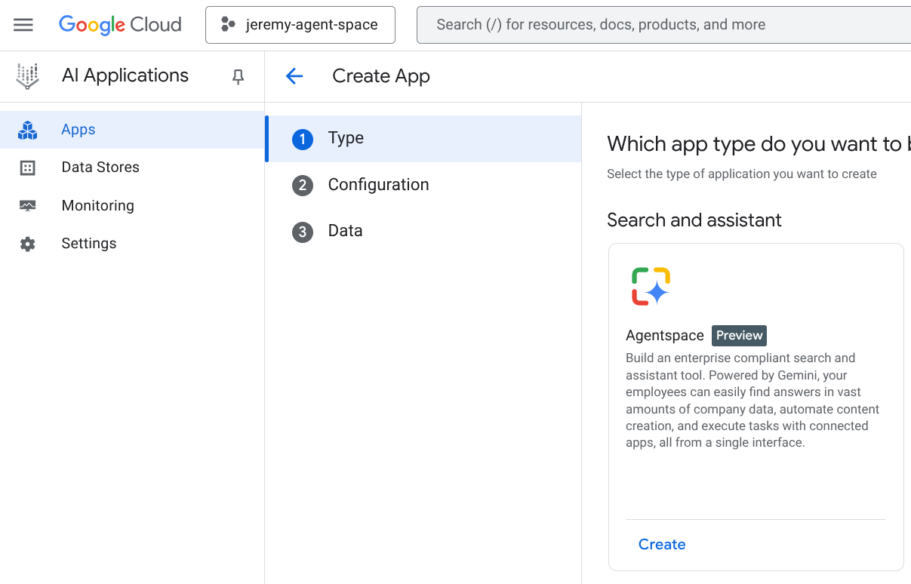
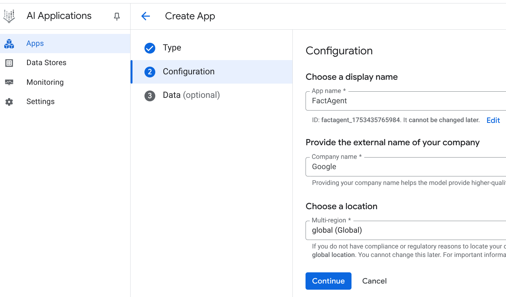
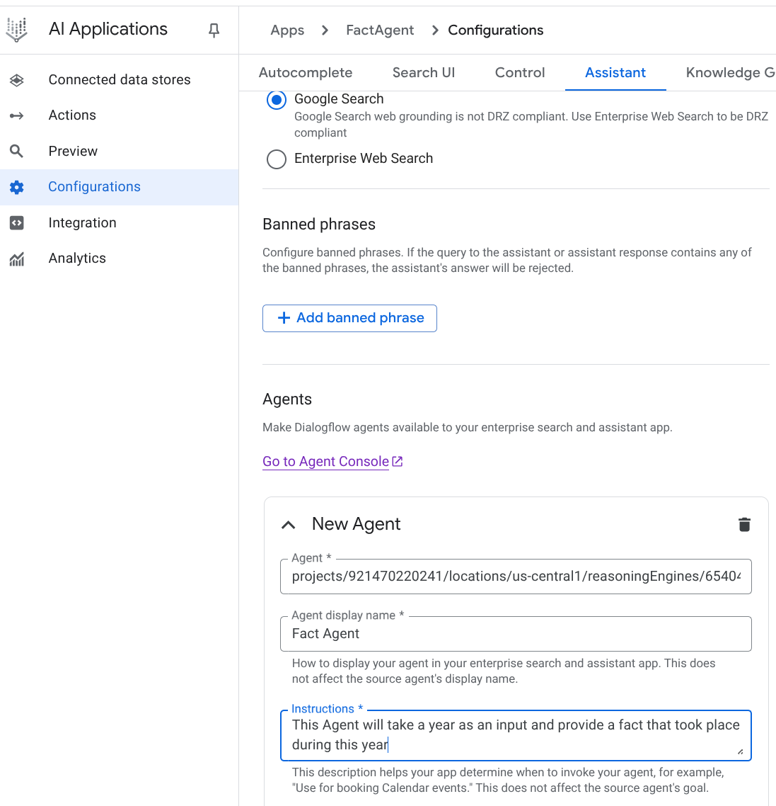
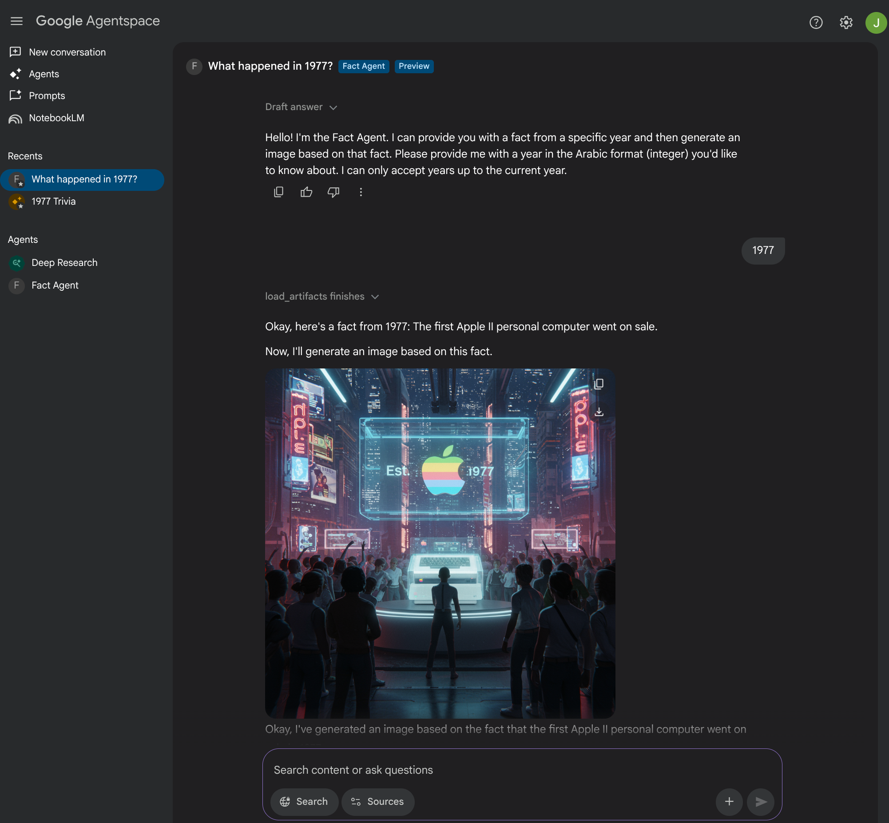

# adk-agentspace
Simple example of a custom Agent developed with ADK and published in AgentSpace

## Setup

1. Make sure your GCP project is registered and supports AgentSpace. To verfiy, you should have the possibility of creating an Agentspace AI Application in GCP




## Install

1. Under the `fact_agent` subfolder, provide the correct `GOOGLE_CLOUD_PROJECT` in the `.env` file.
2. At the root folder, execute the following commands:

```shell
python -m venv .venv
source .venv/bin/activate
pip install google-cloud-aiplatform google-auth
pip install --upgrade --quiet google-cloud-aiplatform[agent_engines,adk]
```

3. Under the `fact_agent` subfolder, execute the following commands:

```shell
python test_local.py
python deploy.py
```

> When the deploy script is finished, in the Terminal output, note the Resource Name (in the form): `projects/<PROJECT_NUMBER>/locations/us-central1/reasoningEngines/6540449315872047104`

4. Create a new `Agentspace` AI Application in the GCP console:



5. Under `Configurations` => `Assitant`, add a new Agents item at the bottom of the page. Paste the previously copied `Resource Name` in the `Agent` field. Provide a display name and a short sentence for Instructions. Save and publish when done:



6. Under integration, copy the link to your web app, and open it in a new tab.

7. Click on your new Agent on the left panel, and provide a date:
