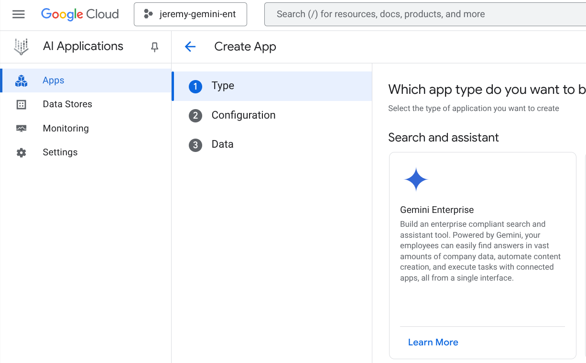

# adk-agentspace
Simple example of a custom Agent developed with ADK and published in AgentSpace


## Pre-requisite

1. This example is meant to work with `python >= 3.12`
2. Install the `UV` Python package manager from https://github.com/astral-sh/uv
3. Check out this repository somewhere where you have a terminal access `git clone git@github.com:jt151077/adk-agentspace.git`
4. For this example you need a GCP Project, as the artifacts will be deployed in Agent Engine, and the AgentSpace provisioned in AI Applications 


## Setup

1. Make sure your GCP project is registered and supports AgentSpace. To verfiy, you should have the possibility of creating an Agentspace AI Application in GCP




## Install

1. CD to the root of the project `adk-agentspace`, provide the correct `GOOGLE_CLOUD_PROJECT` in the `.env` file.
2. At the root folder, execute the following commands:

```shell
uv venv
source .venv/bin/activate
uv pip install -e .
```

3. To test the code, you can use the graphical tool for ADK by launching:

```shell
adk web
```

This will start a webserver running on http://127.0.0.1:8000. By pointing your webbrowser to this address, you can test the code. Below is an example by submitting `1977` as a year:


4. You can also test the Agent from the command line and/or deploy it via the following commands:

```shell
uv run fact_agent/test_local.py
uv run deployment/deploy.py
```

> When the deploy script is finished, in the Terminal output, note the Resource Name (in the form): `projects/<PROJECT_NUMBER>/locations/us-central1/reasoningEngines/6540449315872047104`

5. Create a new `Agentspace` AI Application in the GCP console:


6. Under `Configurations` => `Assitant`, add a new Agents item at the bottom of the page. Paste the previously copied `Resource Name` in the `Agent` field. Provide a display name and a short sentence for Instructions. Save and publish when done:


7. Under the left-hand side panel, click on `Integration`, copy the link to your web app, and open it in a new tab.

8. Click on your new Agent on the left panel, and provide a date:
